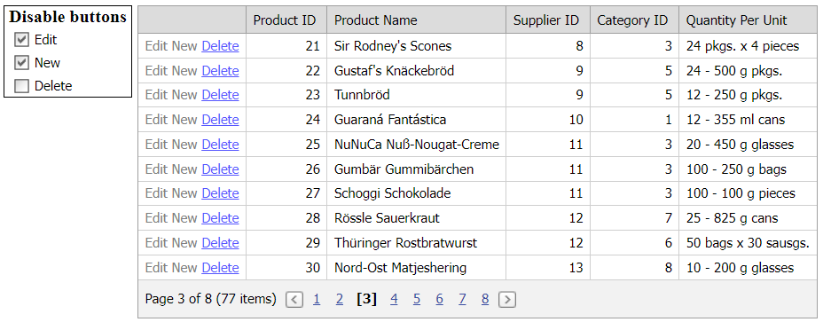

# Grid View for ASP.NET Web Forms - How to enable or disable command buttons on the client
<!-- run online -->
**[[Run Online]](https://codecentral.devexpress.com/e2345/)**
<!-- run online end -->

This example demonstrates how to create a template and add a hyperlink editor to that template to emulate command button functionality. You can enable or disable the command button in the check box editor.



## Overview

Follow the steps below to enable or disable custom command buttons:

1. Specify a column's [DataItemTemplate](https://docs.devexpress.com/AspNet/DevExpress.Web.GridViewDataColumn.DataItemTemplate) property and add a hyperlink editor to the template to create a custom command button.

    ```aspx
    <dx:GridViewDataTextColumn VisibleIndex="0">
        <DataItemTemplate>
            <dx:ASPxHyperLink ID="lnkEdit" runat="server" Text="Edit" NavigateUrl="javascript:void(0);"
                OnInit="lnkEdit_Init" OnLoad="lnkEdit_Load">
                <DisabledStyle ForeColor="gray" />
            </dx:ASPxHyperLink>
            <!-- ... -->
    </dx:GridViewDataTextColumn>
    ```

2. Handle the button's server-side `Init` event and do the following in the handler:

   * Access the button's template container and get the container's visible index.
   * Use this visible index and the button's `ID` property value to specify the button's `ClientInstanceName` property.
   * Handle the button's client-side `Click` event and call the corresponding grid's method to edit data.

    ```csharp
    protected void lnkEdit_Init(object sender, EventArgs e) {
        ASPxHyperLink lnk = sender as ASPxHyperLink;
        GridViewDataItemTemplateContainer container = lnk.NamingContainer as GridViewDataItemTemplateContainer;

        lnk.ClientInstanceName = String.Format("lnkEdit{0}", container.VisibleIndex);
        lnk.ClientSideEvents.Click = String.Format("function (s, e) {{ {0}.StartEditRow ({1}); }}",
            (String.IsNullOrEmpty(container.Grid.ClientInstanceName) ? container.Grid.ClientID : container.Grid.ClientInstanceName),
            container.VisibleIndex);
    }
    ```

3. Add a check box and handle its client-side `CheckedChanged` event. In the handler, call the button's [SetEnabled](https://docs.devexpress.com/AspNet/js-ASPxClientEditBase.SetEnabled(value)) method to enable or disable the command button on the client based on the check box value.

    ```aspx
    <dx:ASPxCheckBox ID="chkEdit" runat="server" Text="Edit" Checked="true">
        <ClientSideEvents CheckedChanged="OnEditCheckedChanged" />
    </dx:ASPxCheckBox>
    ```

    ```js
    function OnEditCheckedChanged (s, e) {
        var start = grid.GetTopVisibleIndex ();
        var end = grid.GetVisibleRowsOnPage () + start;
        for (var i = start; i < end; i++)
            eval("lnkEdit" + i.toString()).SetEnabled(!s.GetChecked());
    }
    ```

## Files to Review

* [Default.aspx](./CS/WebSite/Default.aspx) (VB: [Default.aspx](./VB/WebSite/Default.aspx))
* [Default.aspx.cs](./CS/WebSite/Default.aspx.cs) (VB: [Default.aspx.vb](./VB/WebSite/Default.aspx.vb))

## Documentation

* [Access Controls in Templates on the Server](https://docs.devexpress.com/AspNet/403575/common-concepts/access-controls-in-templates-on-the-server)

## More Examples

* [How to create a custom command button and specify its appearance and functionality based on a row state](https://github.com/DevExpress-Examples/how-to-create-a-custom-command-button-with-the-appearance-and-action-depending-on-a-row-state-e1246)
* [Grid View for ASP.NET Web Forms - How to use external buttons to edit grid data](https://github.com/DevExpress-Examples/aspxgridview-use-external-buttons-to-edit-records)
